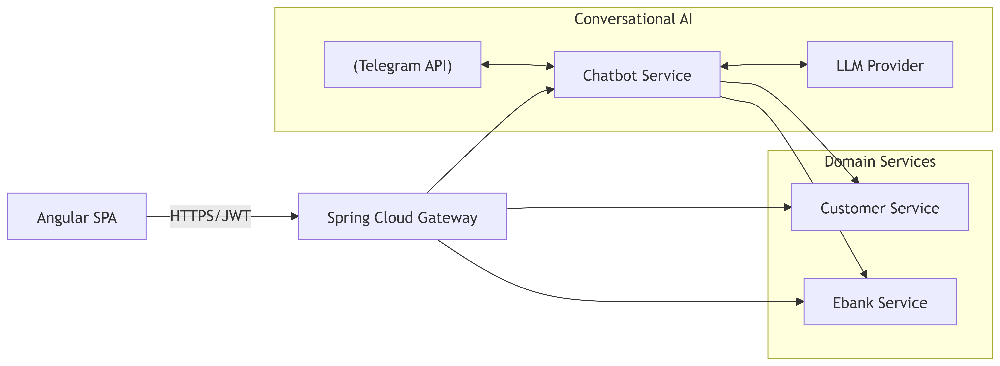

# Ebank – Architecture Simplifiée (Gateway + Services Métiers + Chatbot IA)

Ce repository présente une architecture **simple, modulaire et maintenable** pour exposer des services métiers (Customer / Ebank) via un **API Gateway** (Spring Cloud Gateway), un **Front Angular** et un **Chatbot Service** connecté à un **LLM** et à **Telegram**.

---

## ✨ Principes & objectifs

- **Simplicité d’abord** : réduire les briques “infra” (pas de Discovery/Config au départ).
- **Entrée unique** : un **Gateway** centralise auth, CORS, routage, observabilité.
- **Isolation de l’IA** : toute la logique conversationnelle/LLM vit dans **`chatbot-service`**.
- **Services métiers “propres”** : `customer-service` et `ebank-service` restent focalisés sur le domaine.
- **Évolutivité pragmatique** : ajouter Discovery/Config/Mesh **seulement** si un besoin réel apparaît.

---

## 🧭 Vue d’ensemble fonctionnelle

- **Front (Angular)**  
  Affiche les écrans et consomme **uniquement** le Gateway.
- **API Gateway (Spring Cloud Gateway)**  
  Point d’entrée : authentifie/autorise (JWT), route vers les services, applique CORS/rate-limit.
- **Services métiers**  
  - `customer-service` : gestion des clients.
  - `ebank-service` : opérations bancaires.
- **`chatbot-service`**  
  - Webhook **Telegram** (réception des messages), appels sortants **Telegram API** (réponses).
  - Intégration **LLM** (API/SDK), gestion de prompts, règles, redaction/masking PII.
  - Appels **OpenFeign/REST** vers services métiers si besoin d’enrichissement.

---
